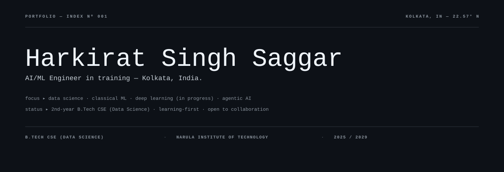
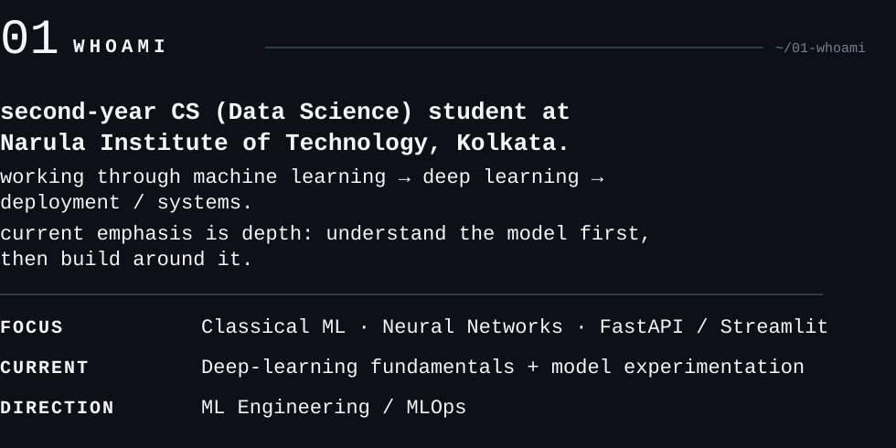
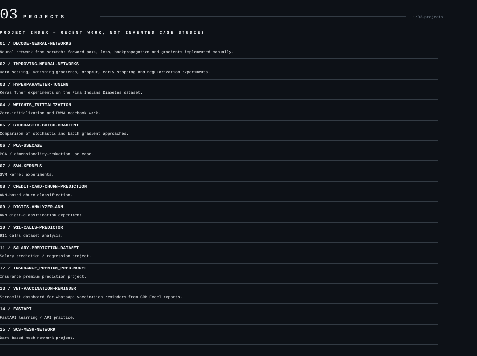
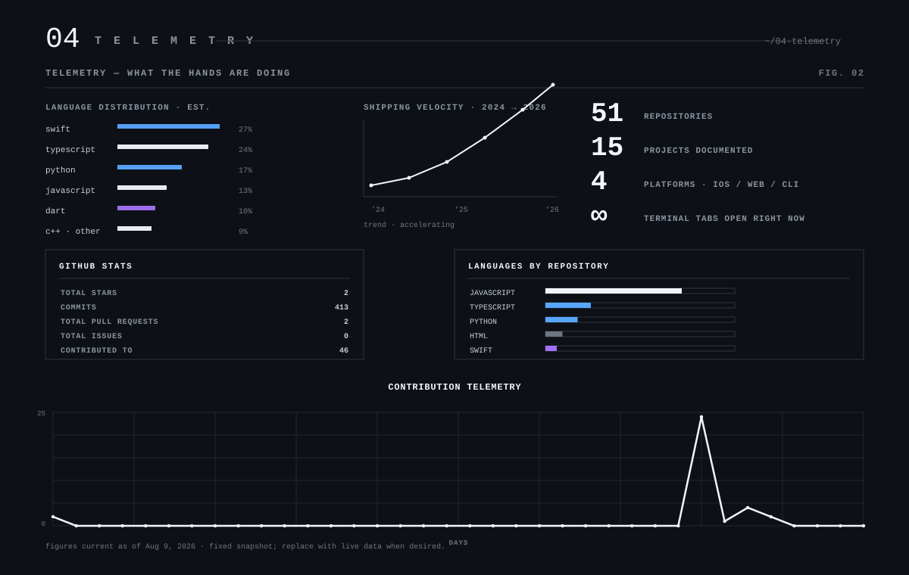
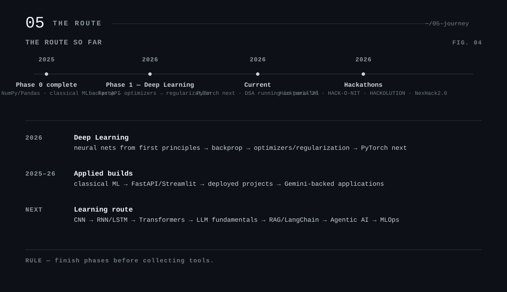
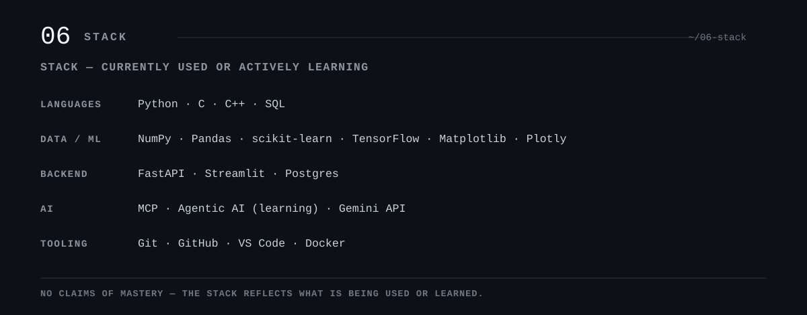
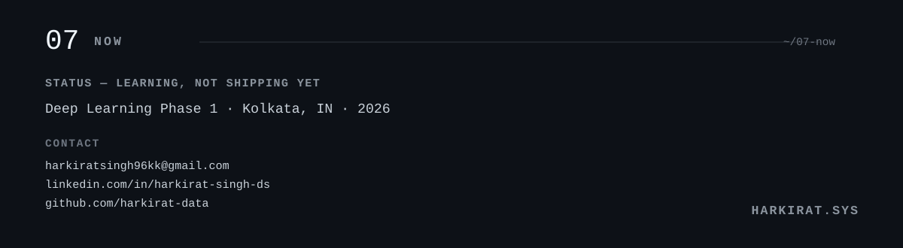

<picture>
  <source media="(prefers-color-scheme: dark)" srcset="assets/dark/header.svg">
  <source media="(prefers-color-scheme: light)" srcset="assets/light/header.svg">
  
</picture>

<picture>
  <source media="(prefers-color-scheme: dark)" srcset="assets/dark/whoami.svg">
  <source media="(prefers-color-scheme: light)" srcset="assets/light/whoami.svg">
  
</picture>

<picture>
  <source media="(prefers-color-scheme: dark)" srcset="assets/dark/ecosystem.svg">
  <source media="(prefers-color-scheme: light)" srcset="assets/light/ecosystem.svg">
  
</picture>

<picture>
  <source media="(prefers-color-scheme: dark)" srcset="assets/dark/projects.svg">
  <source media="(prefers-color-scheme: light)" srcset="assets/light/projects.svg">
  
</picture>

<picture>
  <source media="(prefers-color-scheme: dark)" srcset="assets/dark/telemetry.svg">
  <source media="(prefers-color-scheme: light)" srcset="assets/light/telemetry.svg">
  
</picture>

<picture>
  <source media="(prefers-color-scheme: dark)" srcset="assets/dark/route.svg">
  <source media="(prefers-color-scheme: light)" srcset="assets/light/route.svg">
  
</picture>

<picture>
  <source media="(prefers-color-scheme: dark)" srcset="assets/dark/stack.svg">
  <source media="(prefers-color-scheme: light)" srcset="assets/light/stack.svg">
  
</picture>

<picture>
  <source media="(prefers-color-scheme: dark)" srcset="assets/dark/footer.svg">
  <source media="(prefers-color-scheme: light)" srcset="assets/light/footer.svg">
  
</picture>
