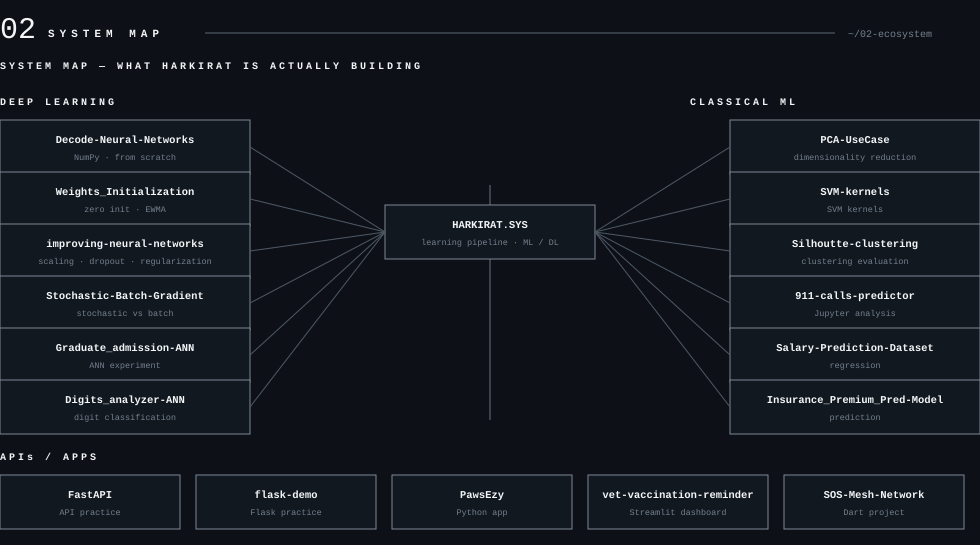
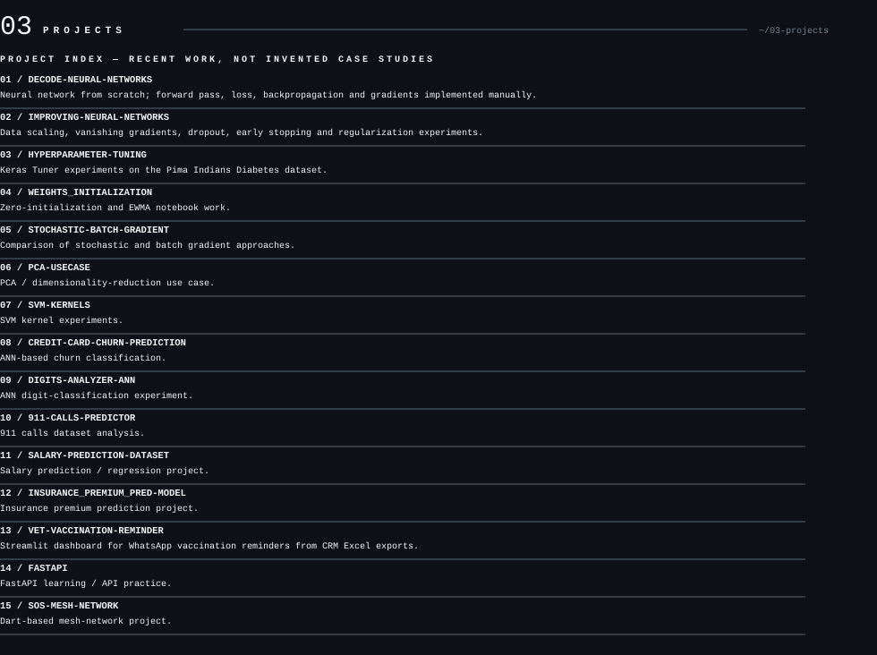
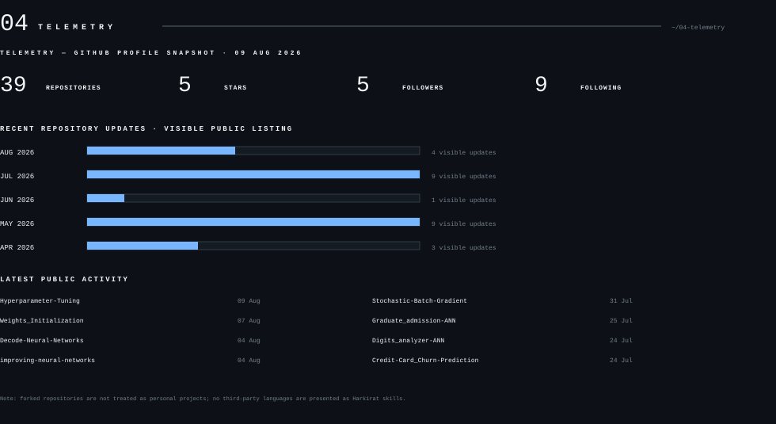
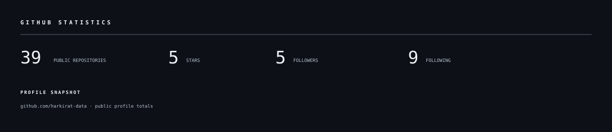
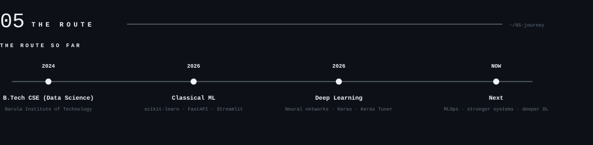
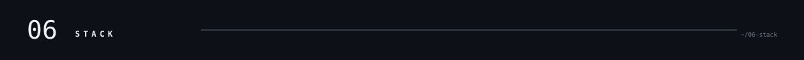

<picture>
  <source media="(prefers-color-scheme: dark)" srcset="assets/dark/header-v1.svg">
  <source media="(prefers-color-scheme: light)" srcset="assets/header-v1.svg">
  
</picture>

<picture><source media="(prefers-color-scheme: dark)" srcset="assets/dark/whoami.svg"><source media="(prefers-color-scheme: light)" srcset="assets/whoami.svg"></picture>
<picture><source media="(prefers-color-scheme: dark)" srcset="assets/dark/ecosystem.svg"><source media="(prefers-color-scheme: light)" srcset="assets/ecosystem.svg"></picture>
<picture><source media="(prefers-color-scheme: dark)" srcset="assets/dark/projects.svg"><source media="(prefers-color-scheme: light)" srcset="assets/projects.svg"></picture>
<picture><source media="(prefers-color-scheme: dark)" srcset="assets/dark/s04.svg"><source media="(prefers-color-scheme: light)" srcset="assets/s04.svg"></picture>

<picture><source media="(prefers-color-scheme: dark)" srcset="assets/dark/github-stats.svg"><source media="(prefers-color-scheme: light)" srcset="assets/github-stats.svg"></picture>

<picture><source media="(prefers-color-scheme: dark)" srcset="assets/dark/timeline.svg"><source media="(prefers-color-scheme: light)" srcset="assets/timeline.svg"></picture>
<picture><source media="(prefers-color-scheme: dark)" srcset="assets/dark/experience.svg"><source media="(prefers-color-scheme: light)" srcset="assets/experience.svg"></picture>
<picture><source media="(prefers-color-scheme: dark)" srcset="assets/dark/s06.svg"><source media="(prefers-color-scheme: light)" srcset="assets/s06.svg"></picture>
<picture><source media="(prefers-color-scheme: dark)" srcset="assets/dark/stack.svg"><source media="(prefers-color-scheme: light)" srcset="assets/stack.svg"></picture>
<picture><source media="(prefers-color-scheme: dark)" srcset="assets/dark/footer.svg"><source media="(prefers-color-scheme: light)" srcset="assets/footer.svg"></picture>

<!-- Keep personal data, links, and asset paths updated. -->
