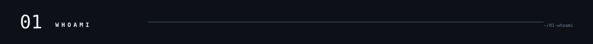
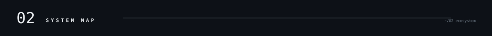
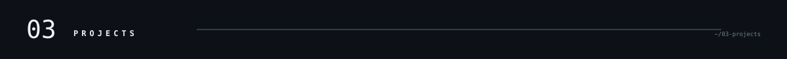
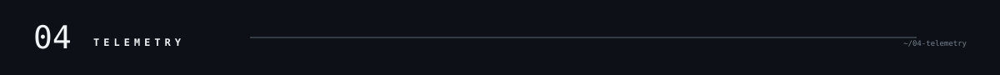
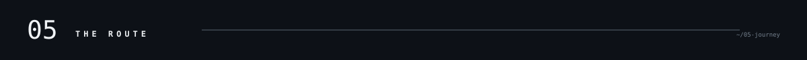

<picture><source media="(prefers-color-scheme: dark)" srcset="assets/dark/header-v1.svg"/><source media="(prefers-color-scheme: light)" srcset="assets/header-v1.svg"/></picture>

<picture><source media="(prefers-color-scheme: dark)" srcset="assets/dark/s01.svg"/><source media="(prefers-color-scheme: light)" srcset="assets/s01.svg"/></picture>
<picture><source media="(prefers-color-scheme: dark)" srcset="assets/dark/whoami.svg"/><source media="(prefers-color-scheme: light)" srcset="assets/whoami.svg"/></picture>
<picture><source media="(prefers-color-scheme: dark)" srcset="assets/dark/s02.svg"/><source media="(prefers-color-scheme: light)" srcset="assets/s02.svg"/></picture>
<picture><source media="(prefers-color-scheme: dark)" srcset="assets/dark/ecosystem.svg"/><source media="(prefers-color-scheme: light)" srcset="assets/ecosystem.svg"/></picture>
<picture><source media="(prefers-color-scheme: dark)" srcset="assets/dark/s03.svg"/><source media="(prefers-color-scheme: light)" srcset="assets/s03.svg"/></picture>
<picture><source media="(prefers-color-scheme: dark)" srcset="assets/dark/projects.svg"/><source media="(prefers-color-scheme: light)" srcset="assets/projects.svg"/></picture>
<picture><source media="(prefers-color-scheme: dark)" srcset="assets/dark/s04.svg"/><source media="(prefers-color-scheme: light)" srcset="assets/s04.svg"/></picture>
<picture><source media="(prefers-color-scheme: dark)" srcset="assets/dark/telemetry.svg"/><source media="(prefers-color-scheme: light)" srcset="assets/telemetry.svg"/></picture>

<picture><source media="(prefers-color-scheme: dark)" srcset="assets/dark/github-stats.svg"/><source media="(prefers-color-scheme: light)" srcset="assets/github-stats.svg"/></picture>

<picture><source media="(prefers-color-scheme: dark)" srcset="https://github-readme-activity-graph.vercel.app/graph?username=harkirat-data&bg_color=00000000&color=ffffff&line=ffffff&point=ffffff&area_color=ffffff&area=true&hide_border=true&radius=0&custom_title=CONTRIBUTION%20TELEMETRY"/><source media="(prefers-color-scheme: light)" srcset="https://github-readme-activity-graph.vercel.app/graph?username=harkirat-data&bg_color=00000000&color=000000&line=000000&point=000000&area_color=000000&area=true&hide_border=true&radius=0&custom_title=CONTRIBUTION%20TELEMETRY"/></picture>

<picture><source media="(prefers-color-scheme: dark)" srcset="assets/dark/s05.svg"/><source media="(prefers-color-scheme: light)" srcset="assets/s05.svg"/></picture>
<picture><source media="(prefers-color-scheme: dark)" srcset="assets/dark/timeline.svg"/><source media="(prefers-color-scheme: light)" srcset="assets/timeline.svg"/></picture>
<picture><source media="(prefers-color-scheme: dark)" srcset="assets/dark/experience.svg"/><source media="(prefers-color-scheme: light)" srcset="assets/experience.svg"/></picture>
<picture><source media="(prefers-color-scheme: dark)" srcset="assets/dark/s06.svg"/><source media="(prefers-color-scheme: light)" srcset="assets/s06.svg"/></picture>
<picture><source media="(prefers-color-scheme: dark)" srcset="assets/dark/stack.svg"/><source media="(prefers-color-scheme: light)" srcset="assets/stack.svg"/></picture>
<picture><source media="(prefers-color-scheme: dark)" srcset="assets/dark/footer.svg"/><source media="(prefers-color-scheme: light)" srcset="assets/footer.svg"/></picture>

<!-- one responsive picture per visual; reference structure preserved, personal data replaced -->
